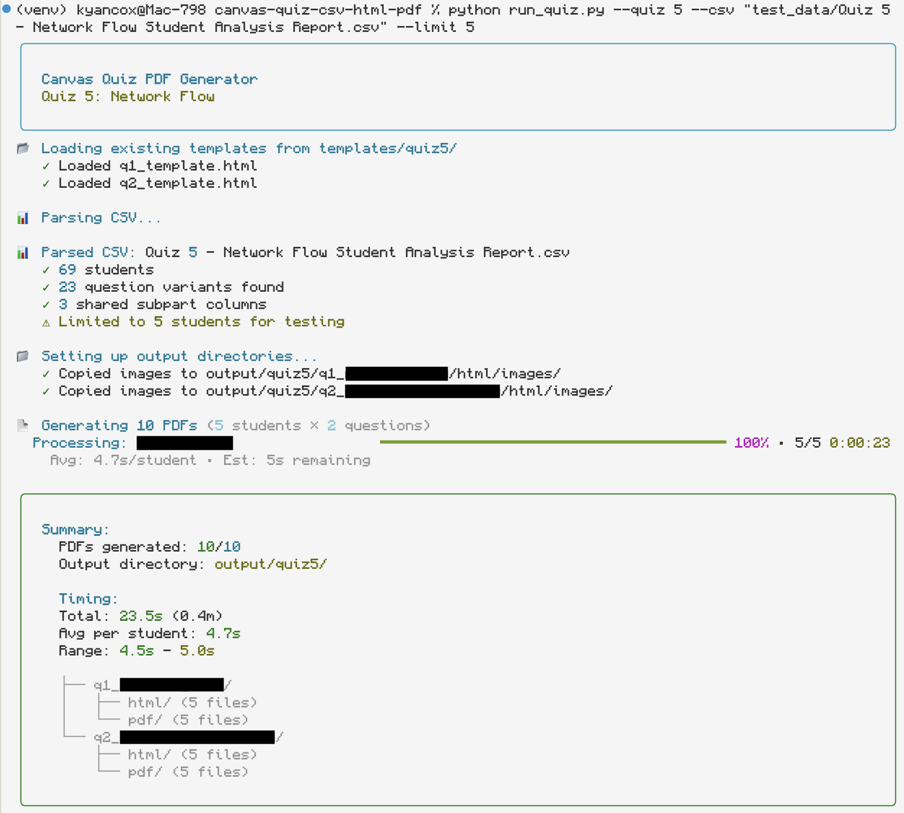

# Canvas Quiz CSV to PDF



A Python tool that converts Canvas quiz exports (CSV format) into individual PDFs per question type per student, containing only the questions they answered (built for CS 577: Introduction to Algorithms @ UW-Madison).

## Problem Statement

Canvas quizzes often have question banks where each student receives different variants (e.g., different graph parameters). When grading:
- TAs want to grade by question type (all Q1s together, then all Q2s)
- Each PDF should show only what the student saw (their specific variant)
- Student answers must be preserved exactly as submitted (HTML, LaTeX, images)

## Solution Architecture

This system generates **2 PDFs per student** (one per question type):
- `q1/pdf/q1v1_nf_Alice_Smith.pdf` - Alice's Q1 variant 1 + her answers + solution
- `q2/pdf/q2v1_nf_Alice_Smith.pdf` - Alice's Q2 variant 1 + her answers + solution

**Filename Format:** `q{question_number}v{variant_number}_{abbreviation}_{student_name}.pdf`

When sorted alphabetically, all variant 1 PDFs are grouped together, then variant 2, etc., making it easy for TAs to grade the same variant consecutively.

### Algorithm Flow

```
1. TEMPLATE GENERATION (once per quiz)
   LaTeX Rubric → Pandoc → HTML Templates
   
   Result: q1_template.html contains ALL 12 variants
           q2_template.html contains ALL 12 variants
           
   Each variant wrapped in: <div data-version="3">...</div>
   Subparts use placeholders: {{PART_A}}, {{PART_B}}, {{PART_C}}

2. CSV PARSING (per student)
   Canvas CSV → Extract:
   - Which variant they received (via tag like [1.9])
   - Map tag to variant number (1.9 → variant 9)
   - Find all answer columns for that variant's subparts
   - Extract answers in order (Part A, Part B, Part C)
   
   Example:
   Alice: Tag [1.1] → Variant 1 of Q1
   Answers: {'a': "<p>6</p>", 'b': "<p>{s},{t}</p>"}

3. HTML GENERATION (per student per question)
   For Alice's Q1 PDF:
   - Load q1_template.html
   - Remove variants 2,3,4,...,12 (keep only variant 1)
   - Replace {{PART_A}} with Alice's Part A answer
   - Replace {{PART_B}} with Alice's Part B answer
   
4. PDF RENDERING
   HTML → Playwright/Chromium → PDF
   - Supports MathJax for equations
   - Preserves student HTML exactly
   - Compact LaTeX-style formatting (~1 page per question)
```

### Key Benefits

1. **Grading Efficiency**: TAs can grade all Q1s together, then all Q2s
2. **Focused PDFs**: Each PDF shows only what the student saw (no blank sections)
3. **Data Integrity**: Student answers never modified or parsed
4. **Scalability**: Generic system works for all 6 quizzes with just config changes
5. **Compact Output**: LaTeX-matching styling keeps PDFs to ~1 page per question

## Tagging System

**Important:** Canvas uses variant-based tagging:
- Each question variant has ONE unique tag (e.g., `[1.9]` = variant 9 of question 1)
- Subparts are NOT tagged (they're the same for all variants)
- Tags appear only on parent questions, not subparts

Example:
- Variant 1: Tagged `[1.1]` → Shows graph_325.png
- Variant 2: Tagged `[1.2]` → Shows Graph_324.jpg
- Variant 9: Tagged `[1.9]` → Shows graph9.jpg

All variants have the same subparts:
- Part (a): "What is the maximum s-t flow?"
- Part (b): "Give a partition forming a minimum s-t cut"

## Requirements

- Python 3.8+
- Pandoc (for LaTeX → HTML conversion)
- Playwright (for PDF generation)

## Setup

1. Install dependencies: `pip install -r requirements.txt`
2. Install Playwright browsers: `playwright install chromium`
3. **Unzip quiz materials**: Extract the quiz zip file into `rubrics/quizX/`
   ```bash
   cd rubrics
   unzip quiz5_materials.zip -d quiz5/
   # This creates: rubrics/quiz5/quiz5_solutions_rubric.tex, graph*.jpg, etc.
   ```
4. Create config file: Copy `configs.example/quiz_config_template.py` to `configs/quizX_config.py`
5. Update config:
   - Set `variant_tags`: List all variant tags (e.g., `['1.1', '1.2', ..., '1.12']`)
   - Set `num_parts`: Number of subparts per variant (e.g., `2` for Q1, `3` for Q2)
   - Set `latex_line_range`: Line range in rubric file
   - **Manual image mapping** (if needed): Add `image_map` dictionary for TikZ graphs

## Usage

```bash
# Test with 5 students (recommended for first run)
python run_quiz.py --quiz 5 --csv "Quiz 5 - Network Flow.csv" --limit 5

# Full run (all students)
python run_quiz.py --quiz 5 --csv "Quiz 5 - Network Flow.csv"

# Force regenerate templates
python run_quiz.py --quiz 5 --csv "Quiz 5.csv" --regenerate
```

## Output Structure

```
output/
└── quiz5/
    ├── q1/
    │   ├── html/
    │   │   ├── Alice_Smith.html  # For debugging
    │   │   └── images/            # Copied from templates
    │   └── pdf/
    │       ├── q1v1_nf_Alice_Smith.pdf   # Variant 1
    │       ├── q1v1_nf_Bob_Jones.pdf
    │       ├── q1v3_nf_Charlie_Brown.pdf # Variant 3
    │       └── ...
    └── q2/
        ├── html/
        └── pdf/
            ├── q2v1_nf_Alice_Smith.pdf   # Variant 1
            ├── q2v2_nf_Bob_Jones.pdf     # Variant 2
            └── ...
```

**Filename Format:** `q{question_number}v{variant_number}_{abbreviation}_{student_name}.pdf`

- `q1v1_nf_Alice_Smith.pdf` = Question 1, Variant 1, Network Flow Quiz, Alice Smith
- `q2v3_nf_Bob_Jones.pdf` = Question 2, Variant 3, Network Flow Quiz, Bob Jones

When sorted alphabetically, PDFs are grouped by variant, making it easy to grade all variant 1s together, then variant 2s, etc.

## Directory Structure

- `core/` - Generic reusable modules
  - `rubric_converter.py` - LaTeX → HTML template generation
  - `csv_parser.py` - Extract variant tags and student answers
  - `html_generator.py` - Map answers to templates
  - `pdf_generator.py` - Playwright PDF rendering
  - `orchestrator.py` - Main workflow coordination
- `configs/` - Quiz-specific mappings (git ignored)
- `configs.example/` - Config template
- `rubrics/` - LaTeX solution files and images (git ignored)
  - `rubrics/quizX/` - Unzip course materials here (contains .tex + images)
- `templates/` - Generated HTML templates (git ignored)
- `output/` - Generated PDFs (git ignored)
- `test_data/` - Mock CSVs for testing (git ignored)

## Config Format

```python
QUIZ_CONFIG = {
    'quiz_id': 5,
    'quiz_name': 'Network Flow',
    'abbr': 'nf',  # Abbreviation for quiz (used in PDF filenames)
    'rubric_folder': 'quiz5',  # Folder in rubrics/ containing .tex file and images
    
    'question_groups': [
        {
            'id': 'q1',
            'name': 'Question 1',  # Generic question name
            'variant_tags': ['1.1', '1.2', '1.3', ..., '1.12'],  # One tag per variant
            'num_parts': 2,  # Number of subparts (same for all variants)
            'latex_line_range': (45, 671),
            'num_versions': 12,
            'points': 3,
            'image_map': {  # Optional: for TikZ graphs
                1: 'graph_325.png',
                2: 'Graph_324.jpg',
                # ...
            }
        },
        {
            'id': 'q2',
            'name': 'Question 2',  # Generic question name
            'variant_tags': ['2.1', '2.2', ..., '2.11'],
            'num_parts': 3,  # 3 subparts per variant
            'latex_line_range': (702, 1202),
            'num_versions': 11,
            'points': 6
        }
    ]
}
```

## Image Handling

### Automatic (Recommended)
If your LaTeX uses `\includegraphics{filename.png}`, images are automatically detected and copied to output folders.

### Manual Mapping (TikZ Graphs)
For Quiz 5 (Network Flow), the rubric uses TikZ code to draw graphs. Since TikZ doesn't convert to HTML, we manually map each question variant to a pre-rendered image:

```python
'image_map': {
    1: 'graph_325.png',   # Variant 1 → graph_325.png
    2: 'Graph_324.jpg',    # Variant 2 → Graph_324.jpg
    3: 'network.png',      # Variant 3 → network.png
    # ... etc
}
```

**For future quizzes:** If you have TikZ graphs, you'll need to:
1. Export/screenshot each graph as an image file
2. Add the `image_map` dictionary to your config
3. Place images in `rubrics/quizX/` folder

The converter will automatically replace TikZ code with `\includegraphics` based on this mapping.

## CSV Parsing Notes

**Current Status:** CSV parser is implemented but may need refinement based on actual Canvas export structure.

The parser:
1. Searches for variant tags (e.g., `[1.9]`) in column headers
2. Maps tags to variant numbers using config
3. Finds answer columns for subparts (structure depends on Canvas export format)
4. Extracts answers in order (Part A, Part B, Part C)

**When real CSV arrives:** Verify column structure and adjust parser if needed.

## Styling

PDFs use compact LaTeX-style formatting:
- Serif font (Computer Modern / Times New Roman)
- Reduced margins and spacing
- ~1 page per question (down from 3 pages)
- Images sized appropriately (max 400px wide)
- Student answers in orange boxes, solutions in green boxes

## Troubleshooting

**Images not appearing:**
- Check that images are in `rubrics/quizX/` folder
- Verify `image_map` is correct in config
- Check HTML files in `output/quizX/qY/html/` to see if images load

**All variants showing:**
- Regenerate templates: `python test_rubric_converter.py`
- Check that variant filtering is working in HTML generator

**Answers not mapping correctly:**
- Verify CSV column structure matches parser expectations
- Check HTML files to see if placeholders were replaced
- Use `--limit 1` to debug single student

## Development

```bash
# Regenerate templates
python test_rubric_converter.py

# Test CSV parsing
python -c "from core.csv_parser import CanvasCSVParser; from importlib import import_module; config = import_module('configs.quiz5_config').QUIZ_CONFIG; parser = CanvasCSVParser('test_data/mock.csv', config); students = parser.get_student_data(); parser.print_student_summary(students[0])"
```

## Known Limitations

- CSV column structure may vary between quizzes (needs verification with real data)
- Q2 questions may appear out of order (to be fixed)
- Requires manual image mapping for TikZ graphs
